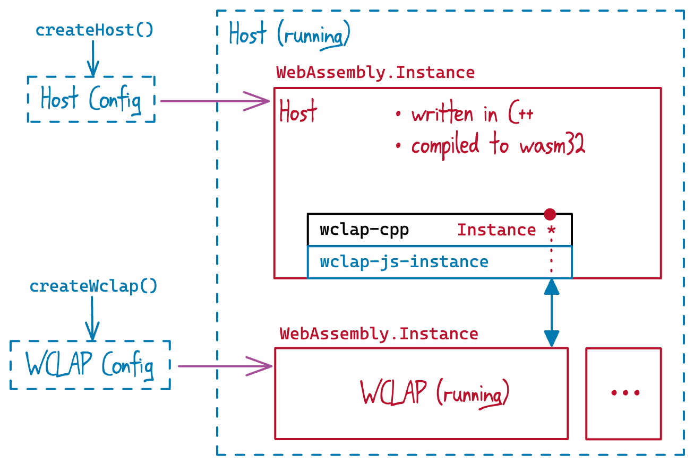

# Hosting CLAP in the browser

This repo provides an example browser host for CLAP plugins [compiled to WASM](https://github.com/geraintluff/wclap-cpp?tab=readme-ov-file#what-is-a-wclap).  Any plugin which can be fetched with CORS can be specified with `?module=<...>` in the URL.

By default it loads WASM builds of [Signalsmith Basics](https://github.com/Signalsmith-Audio/basics).  The repo also includes my more [minimal CLAP examples](https://github.com/geraintluff/signalsmith-clap-cpp) (including webview UIs with the webview CLAP draft extension) which can be seen running [here](https://signalsmith-audio.github.io/wasm-clap-browserhost/?module=plugin/example-plugins-wasm32.wclap.tar.gz).

## AudioWorklet wrapper

The host is built on top of a wrapper (in `clap-audionode/`] which load a single WCLAP as an `AudioNode` (backed by an `AudioWorkletProcessor`).

This is implemented by writing a C++ WCLAP host (see `clap-audionode/host-dev/host.cpp`) which provides a simpler API to the JS nodes.

## C++ and JS library

The cleanest way to interact with WCLAPs in the browser is to write a C++ WASM host, which then exposes a simpler API to your custom JS.  This keeps all the CLAP-specific structures in the "native" world.

This repo provides `wclap-js-instance`, a C++ library (`.h`/`.cpp` pair) which for building your WCLAP host.  This is built on top of [`wclap-cpp`](host-dev/modules/wclap-cpp), and provides an `Instance` implementation which abstracts all the WCLAP interactions (e.g. calling WCLAP functions, reading/writing structures in its memory).

It also provides a JavaScript library (ES6 module: `wclap-js/wclap.mjs`) which can load hosts written using the above `wclap-js-instance` library, and manages the corresponding `WebAssembly`

It also provides a WASI helper (written in C++, with JS to load it).  Currently this only implements the very basics (logging and random numbers), but it defines all the functions for `wasi_snapshot_preview1` (32-bit only).
